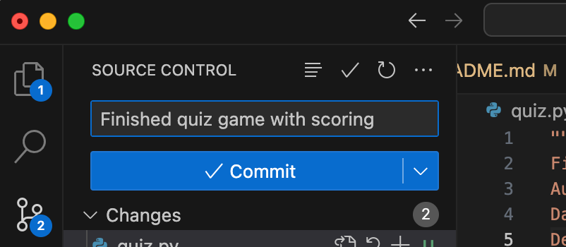
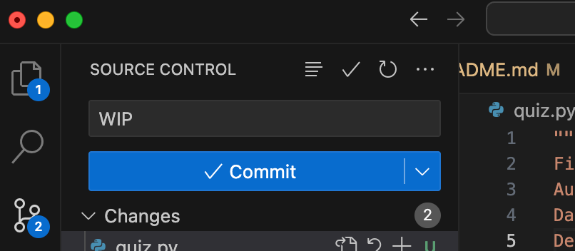
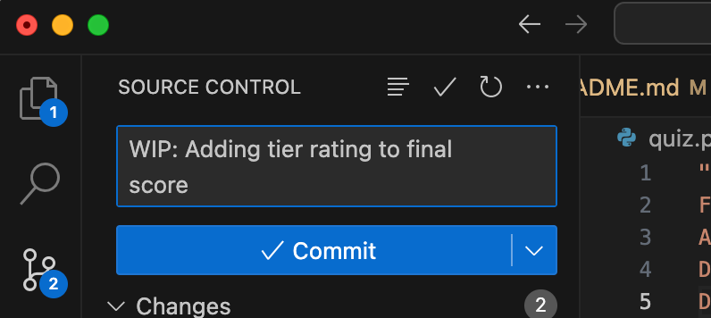

# Conditionals Practice: Quiz Game

## Description
Create a simple multiple-choice quiz game, `quiz.py`. The program should ask the user a series of questions and check their answers. After all the questions have been answered, the program should display the final score.

## Requirements
1. The quiz should consist of at least 3 questions. 
2. Each question should have multiple choices, and the user should input their answer.
3. The program should compare the user’s answer with the correct answer using conditional branching (`if`/`elif`/`else` statements).
4. Keep track of the user’s score and display it at the end of the quiz. Use rounding to output a percentage score.
5. You can assume the user will enter only lowercase letters (but for a challenge, have the program function correctly with uppercase letters as well!)
6. Use meaningful prompts for questions and provide feedback on whether the answer is correct or incorrect.

## Example Output
While the questions in the example below are general trivia, try to write your program with a theme for all of your questions (e.g. Generation I Pokémon, organic chemistry, queens on RuPaul's Drag Race, etc.)

```
Multiple-Choice Quiz Game

1. What is the capital of France?
(a) Paris
(b) London
(c) Rome

> a
Correct!

2. Which planet is known as the Red Planet?
(a) Mars
(b) Venus
(c) Jupiter

> b
Incorrect.

3. Who painted the Mona Lisa?
(a) Leonardo da Vinci
(b) Pablo Picasso
(c) Vincent van Gogh

> c
Incorrect.

Quiz complete!
You answered 1 out of 3 questions correctly. Your score is 33.3% 
```

## Getting Feedback
I will be testing out GitHub's system for providing ongoing feedback through something called a Pull Request. I'll explain more about what this is in class, but in the meantime, Commit & Push (or Sync) your repo as normal, but make sure to write a meaningful commit message. 

## Write Meaningful Commit Messages

Commit messages are a way to communicate changes made to the codebase. They should be clear and informative to help others (including your future self) understand what was done.

**Start with a Brief Summary.** A one-line commit message should be a concise summary of what the commit accomplishes. It should be clear and descriptive, giving an overview of the changes.

**Use Descriptive Language** Use descriptive language in your commit messages. Instead of just saying "done", they should specify what was done. For example, "*Implemented a function to calculate factorial*" or "*Fixed a bug in the loop condition*".

**Indicate Work in Progress (WIP)** If you're still working on a feature or a fix, use "WIP" in the commit message. For example, "*WIP: Adding input validation for user age*".

**Indicate Completion** When you finish working something, clearly indicate it in the commit message. You can use phrases like "*Completed*", "*Finished*", or "*Implemented fully*". For example, "*Completed user authentication feature*".

**Include Details for Revisions/Changes** If you need to make revisions or changes based on feedback, you should mention it in the commit message along with what changes were made. For example, "*Revised function logic based on feedback*" or "*Updated variable names for clarity*".

### Examples of Commit Messages
#### Example: Completion
This message would indicate the program is finished and ready for general use, marking, or feedback:

<div style="text-align:center">
    
</div>

#### Example: Work in Progress
If you are the only one working on the repo, it may suffice just to remind yourself (and me) that the code is a *work in progress* (or "*WIP*", for short) and not yet ready for review:

<div style="text-align:center">
    
</div>

#### Example: Work in Progress - Informative
This message is a little more informative about the WIP, useful if there are others working on the same codebase:

<div style="text-align:center">
    
</div>
